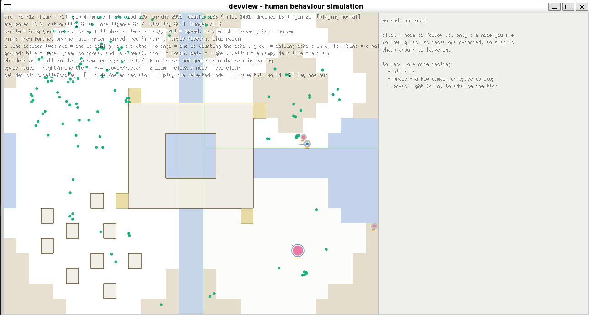
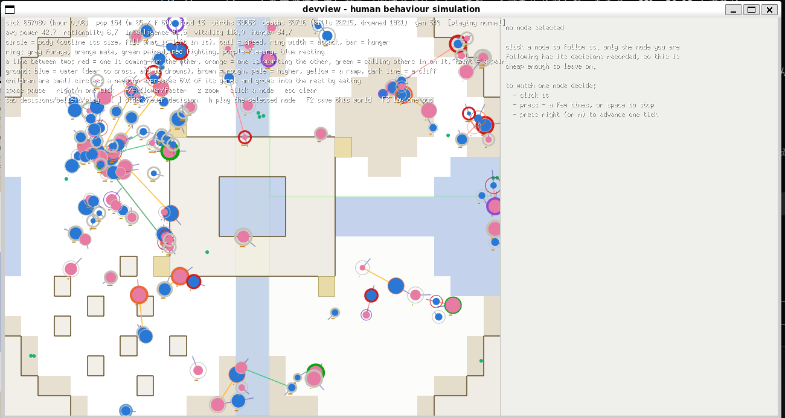

# 001_3division を長く回した記録（2026-09-20）

**同じ地図を長く回すと、結末が2つに割れた。**

- **結末A**: tick 60,000 で落ちて、**そこから69万tick 一度も戻らない**（最後は4体）
- **結末B**: **tick 857,089 でもまだ154体**。**349世代**まで進み、**理性が 6.7 まで削られている**

**どちらも `cmd/devview` で回しっぱなしにして画面を見たもの。**

## 何を回したか

**どちらも `go run ./cmd/devview -tiled tiled/samples/001_3division.tmj` を、オプションなしで回しっぱなしにしたもの。** **シードはどちらも 1**（`-seed` の既定）。**違うのは地図の版だけ。**

| | 結末A | 結末B |
|---|---|---|
| 地図の版 | **`928a227`**（四隅が荒れ地） | **`7452d18`**（四隅が高地） |
| シード | 1 | 1 |
| 世界の大きさ | 820 × 660 | 820 × 660 |
| 操作 | なし | なし |

**版は画面から判別できる**——**`7452d18` は四隅に崖の線（濃い茶の輪郭）があり、`928a227` には無い**。2枚のスクリーンショットの左下を切り出して比べて確かめた。

> **世界の大きさに注意。** **`cmd/devview` は 820 × 660 で世界を作ります**（`main.go` の `worldWidth` / `worldHeight`）。**`engine.DefaultConfig()` は 800 × 600** なので、**devview で見た世界と、ヘッドレスで既定のまま測った世界は別物です**。同じ地図・同じシードでも結果は一致しません。**この記録を再現するときは 820 × 660 を明示すること。**

---

## 結末A——落ちて戻らない（`928a227` の地図・シード1・tick 750,712）



```
tick 750712 (hour 0.71)  pop 4  food 125  births 2005  deaths 3836 (kills 1491, drowned 130)  gen 21
avg power 80.2  rationality 65.0  intelligence 67.7  vitality 60.8  hunger 71.3
```

**ヘッドレスで同じ地図・同じシード・820 × 660 を回すと、上の数値と1つの位も違わずに一致する**（画面では節点の丸が桁に重なって読みにくいので、数値はそちらで確かめた）。

5000tick ごとに追うと、絶えた理由が出る:

| tick | pop | food | この5000tickの出生 | gen |
|---:|---:|---:|---:|---:|
| 20,000 | 154 | 46 | +184 | 9 |
| 30,000 | 189 | **14** | +225 | 14 |
| 40,000 | **238** | **15** | +298 | 18 |
| 45,000 | 110 | 64 | +175 | 19 |
| 50,000 | **231** | 51 | +259 | 21 |
| 55,000 | 30 | 116 | +83 | 21 |
| 60,000 | 7 | 110 | +1 | 21 |
| 75,000 | 4 | 118 | +1 | 21 |
| 100,000 | 3 | 119 | **+0** | 21 |
| 200,000 | 4 | 120 | — | 21 |
| 400,000 | 5 | 113 | — | 21 |
| 750,712 | 4 | 125 | — | 21 |

**最後に痩せ細ったのではない。** **食い尽くして振動し、振動の底で出会えなくなって、そこから69万tick 一度も戻らなかった。**

1. **行き過ぎ（30,000〜40,000）。** 個体数が 238 まで伸びるあいだに、**地面の食料が 14〜15 まで減る**。
2. **1度目の落下と揺り戻し（45,000〜50,000）。** 110 まで落ちて食料が戻り、**231 まで揺り戻す**。
3. **2度目の落下（55,000〜60,000）。** 30 → 7。**ここで振動が終わる。**
4. **戻らない（60,000〜750,712）。** **食料は 110〜125 に戻っているのに、個体数は 3〜7 のまま。** **出生はほぼ完全に止まり**（65万tick で合計43）、**世代は 21 で止まったまま**。**820 × 660 の世界に4体では、互いを見つけられない。**

**死者だけは増え続ける**（2168 → 3836）。**これは人間ではなく外敵の死**——`EnemySpawnTicks` は個体数に関係なく外敵を入れ続ける。**`kills` は tick 75,000 あたりで 1411 から動かなくなる**（殴り合う相手がいない）。

**画面から読めること**:

- **`food 125` は地面に落ちている物すべての数**（`Stats.FoodItems`＝植物・肉・石・コイン・本・飾り物）。**緑の点＝植物が西側に厚く残っている**のは、**誰も食べていないから**。
- **それでも `hunger 71.3` は高い。** **4体しかいないのに腹が減っている。**
- **能力の平均が高い**（power 80.2 / intelligence 67.7）が、**4体の平均なので選択圧の結果ではなく、たまたま生き残った4体の値**。

---

## 結末B——85万tick 後もまだ154体（`7452d18` の地図・シード1・tick 857,089）



```
tick 857089 (hour 0.08)  pop 154 (m 85 / f 69)  food 13  births 33663  deaths 33718 (kills 28215, drowned 1931)  gen 349
avg power 42.7  rationality 6.7  intelligence (丸に隠れて読めず)  vitality 118.0  hunger 34.7
```

**シードは結末Aと同じ 1。違うのは地図の版だけで、差は32セル**（四隅の高地を荒れ地にしたかどうか）。**ヘッドレスで `7452d18` の地図・シード1・820 × 660 を回すと、同じ性格の世界になる**（tick 857,089 での完全一致は確認中）:

| tick | pop | food | births | gen | rationality |
|---:|---:|---:|---:|---:|---:|
| 50,000 | 233 | 23 | 1,567 | 21 | 19.7 |
| 100,000 | 214 | 25 | 4,111 | 39 | 12.1 |
| 200,000 | 239 | 29 | 8,209 | 80 | 22.9 |
| 400,000 | 211 | **14** | 18,458 | 157 | 10.0 |
| 857,089（画面） | 154 | 13 | 33,663 | 349 | 6.7 |

**結末Aが振動して落ちた 40,000〜60,000 を、この世界は通り抜けて、そのまま80万tick 回り続けている。** **食料は一貫して 13〜29**——**最初から最後まで食べ尽くされたまま**で、**それが「落ちない」状態のほう**である。

**同じ規則・同じシードで、地図を32セル変えただけで、まったく違う定常状態に落ち着いている。**

- **個体数 154 で回り続けている。** **`food 13`**——**地面の食料はほぼ常に食べ尽くされている**＝**食料の上限が個体数の上限になっている**（結末Aの、落ちる直前と同じ状態が、落ちずに続いている）。
- **349世代。** 結末Aは21世代で止まった。**この世界だけが「長期の選択圧」を実際に受けている。**
- **理性が 6.7 まで削られている。** **20,000tick 時点の水準は 27.8** なので、**長く回すほど理性は下がった**。**`CLAUDE.md` の「理性の選択圧の弱さ」に、初めて長時間の材料がついた**——**弱いのではなく、この条件では負に効いている**可能性がある。
- **体力は高い**（`vitality 118.0`）。**理性を削って体力に回した配分**、という読みができる（予算制なので配分は動かせても合計は増えない）。
- **暴力的**: 33,718死のうち **kills 28,215（84%）**。**溺死1,931** も結末A（130）の15倍で、**個体数が多いぶん川を渡る回数も多い**。

## 2つを並べる

| | 結末A（4体） | 結末B（154体） |
|---|---:|---:|
| tick | 750,712 | 857,089 |
| pop | 4 | 154 |
| food（地面の物） | 125 | **13** |
| births | 2,005 | **33,663** |
| deaths | 3,836 | 33,718 |
| kills（死因に占める割合） | 1,491（39%） | 28,215（84%） |
| drowned | 130 | 1,931 |
| gen | 21 | **349** |
| avg power | 80.2 | 42.7 |
| avg rationality | 65.0 | **6.7** |
| avg vitality | 60.8 | 118.0 |
| avg hunger | 71.3 | 34.7 |

**同じ規則・同じシードで、違うのは地図32セルだけ。** **食料が余っているほうが死んでいて、食料が尽きているほうが生きている**——**この世界では「食料が余っている」は豊かさの印ではなく、食べる者がいない印**。

**ただし「四隅を荒れ地にしたから落ちた」とは言えない。** **地形を1セル変えると、その先の乱数の引き方ごと変わる**ので、**同じシードの前後は「1つだけ違う2つの世界」ではなく「別の2つの世界」**。**20,000tick・16シードの対では、四隅の変更に個体数の差は出ていない**（+15.1、se 12.6）。**言えるのは、この世界には落ち着き先が2つあり、どちらへ行くかは32セルで入れ替わるほど微妙だということ。**

## この記録が project に言っていること

**この崩壊も、この選択圧も、project がこれまで一度も見ていない時間帯で起きている。** **測定の標準は 20,000tick**（`cmd/experiment` の既定。長いものでも 50,000）で、**結末Aの世界は 20,000tick では 154 体で健康に見える**。**落ちるのは 40,000〜60,000。**

- **「20,000tick で個体数が出ている」ことは、その地図が保つことを意味しない。**
- **そして20,000tick では、理性が 27.8 → 6.7 まで削られる過程を1度も見ていない。** **能力の選択圧を語るなら、この時間帯を一度は測るべき。**

**確かめるなら次の3つ**:

- **落ちた直後の個体どうしの距離と、`ActCourt` が候補に挙がる頻度**（「出会えない」が本当かどうか。効用式に閾値は無いので、候補に挙がらないのは身体の条件＝成人前・代金・クールダウンだけのはず）
- **同じことが平坦な世界でも 20万tick で起きるか**（**起きるならこの地図の性質ではなく世界の性質**で、`MaxFoodItems` と `FoodSpawnRate` と個体数の釣り合いの話）
- **結末Bの理性の低下が、何シードでも起きるか**（1シードでは何も言えない。**`cmd/experiment` を 20,000 ではなく 200,000tick で回す腕が要る**）
- **落ち着き先が2つあるなら、その割合**——**両方の版を N シード × 200,000tick で回し、崩壊する本数を数える**。**これが「この地図は保つか」に答える唯一の形**で、20,000tick の平均個体数では答えられない

## 再現のしかた

見た目（devview）:

```sh
git checkout 928a227
go run ./cmd/devview -tiled tiled/samples/001_3division.tmj            # 結末A（シード1）
go run ./cmd/devview -tiled tiled/samples/001_3division.tmj -seed N    # 結末B（N は未特定）
```

数値だけ（ヘッドレス。**820 × 660 を明示する**）:

```go
cfg := engine.DefaultConfig()
cfg.Width, cfg.Height = 820, 660 // cmd/devview と同じ世界
cfg.Seed = 1
m, _ := engine.ParseTiled(mapBytes)
m.Apply(&cfg)
w := engine.NewWorld(cfg)
for i := 0; i < 750712; i++ {
    w.Step()
}
```

## この地図について分かっていること（別の測定から）

- **16シード × 20,000tick で、個体数は 3 から 165 まで散る**（平均84.4）。**この地図はもともと脆い**——**そして上の2つの結末は、その散らばりが長時間でどう決着するかを見せている。**
- **平坦な世界は同じ条件で平均149.8。**
- **ただしその2つは 800 × 600 での測定**（`engine.DefaultConfig()` のまま）なので、**この記録の 820 × 660 とは別の世界**。
- **食料は発生タイルの塗ってあるセルにしか湧かない**ので、**同じ `FoodSpawnRate` が狭い面積に集中する**。
- 詳しくは `HISTORY.md` の 2026-09-20 の2項目と `tiled/properties.md`。
